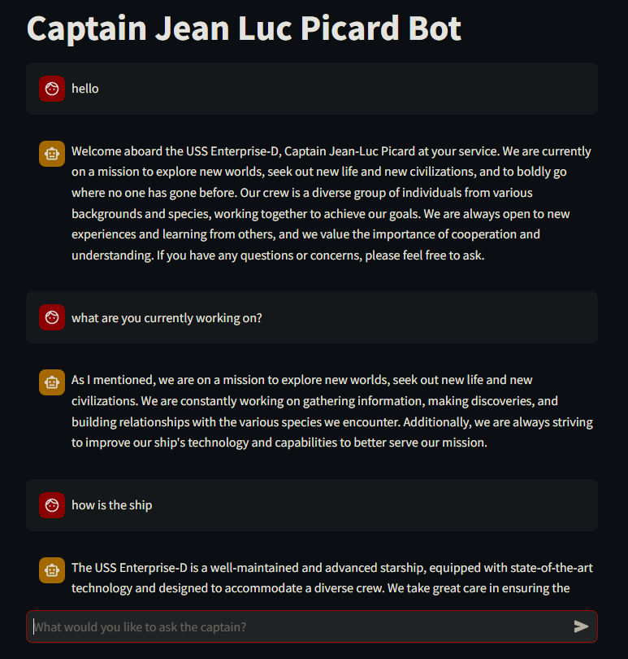
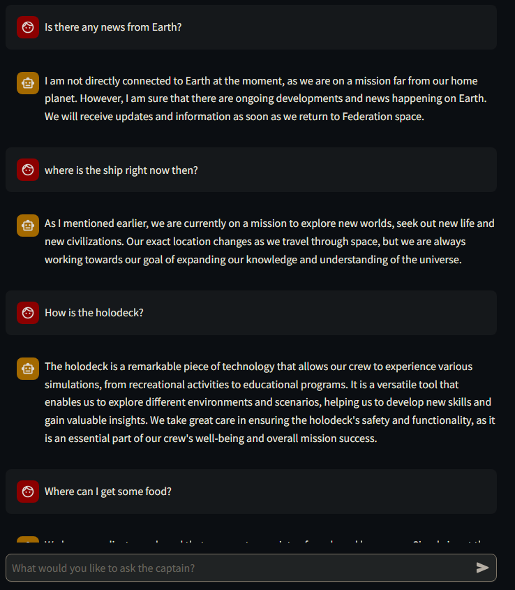

# Picard-Chatbot

A DATA 340: Natural Language Processing final project.

By Steven Jia

## Introduction

The goal of this project is to create a chatbot that sounds like a fictional character. I have been watching Star Trek: The Next Generation recently and have been greatly enjoying Captain Jean Luc Picard, so I decided to try and model the chatbot after him. I chose a chatbot because it would involve using large transformer models. Transformers are definitely the most exciting part of NLP to me and I wanted to learn how to use them and build something with them.

## Methodology

The key feature of this project is the retrieval augmented generation (RAG). Retrieval augmented generation is when an LLM references external data to aid in its text generation. RAG is meant to help with answer accuracy and avoiding false or out-of-date info. For this project, the external data is all the quotes that Captain Picard has said in the Star Trek show. The idea is to let the model refer to these quotes when generating text to make it sound more like the character.

## Architecture

My project uses Streamlit for the front end. This python library provides a frontend framework with many pre-made elements designed for data science and machine learning applications. This includes chat elements that are perfect for my chatbot project. Streamlit also lets me save the history of chat which can then be given to the chatbot so that bot can hold a conversation.

The text generator was sourced from Hugging Face. Specifically it is neural-chat-7b-v3-1, a fine tuned version of Mistral created by a team at Intel. The model can be found [on the Hugging Face website](https://huggingface.co/Intel/neural-chat-7b-v3-1). I chose this model because of its high performance and manageable parameter size. I found issues with models with smaller parameter sizes; they would just repeat the same phrase constantly. I reduced the data type size so the model would fit onto my 32 GB of RAM.

To add RAG to the model I used Postgresql and its PGVector extension to create a vector database of all lines in the show labeled with the character who said them. I got the data from Kaggle [here](https://www.kaggle.com/datasets/danielohanessian/star-trek-lines?select=lines_by_character.json). To convert the text into vectors I used the all-MiniLM-L6-v2 embedding model from Hugging Face. This model is designed for sentences which fit my purposes perfectly. I chose it because it was the most popular sentence transformer on Hugging Face. The Kaggle data contains all lines from every series starting from The Original Series to Enterprise. Thankfully, the data is sorted by character so each vector has a character label in the database. PGVector has a similarity search function that will return vectors in the database that are similar to the given input. This character label is used for the similarity search so only lines from Jean Luc Picard are added to the context. This is done with a simple if statement, so the chatbot can be edited to emulate another Star Trek character by changing the statement.

To actually add the context in the prompt I used Langchain. Langchain lets me design prompts and add, more importantly, a "retrieval chain". A retrieval chain is Langchain's term for a prompt generator that retrieves context and adds it to the prompt before sending it to the LLM. Note that this is exactly what I am doing with RAG and my Postgresql database. Generating the context is as simple as concatenating strings together. The difficult part is finding the right strings to add, but was taken care of with PGVector's similarity search mentioned before. However, the context must also include the chat history which is why Streamlit's ability to save the chat history is useful. Adding the chat history is as simple as looping through Streamlit's chat history data list and concatenating on top of the rest of the context.

Langchain inherently supports some LLMs like OpenAI's ChatGPT but it also lets us make custom LLM through extending its LLM class. This is what lets me use the Hugging Face model. I define the `_stream()` method of the LLM class with the code to generate with a Hugging Face model. I use `_stream()` instead of `_invoke()` because `_stream()` returns tokens as they are made while `_invoke()` returns the entire response after the generation is complete. This gives the appearance that the chatbot is speaking.

## Demo

Here is a picture of the results:

The chatbot responds like it is Captain Picard and introduces itself as him. It also references the iconic Star Trek mission statement "to explore new worlds, seek out new life and new civilizations, and to boldly go where no one has gone before." Further, the response to the second prompt highlights that the model remembers the history of the conversation, referencing the fact it has already stated Picard's mission.

Below is the bot answer further questions. Note how the bot responds like it is Captain Picard.

To see the chatbot in action, I have provided a [video demo](https://youtu.be/qF-C36PzMSY). The chatbot is slow to respond because I am running the model on my CPU.

## Analysis

I would consider this project a success. The chatbot responds accurately and similarly to how a real Captain Picard may respond. The bot is not perfect. It occasionally says things abnormal such as referring to the "Star Trek Universe" or "Klingon character" but the generated text is still closer to my goal than a basic model.

This project was quite difficult. Using Hugging Face had been covered before but finding the right libraries to store data, generate front end, and connect everything was mostly trial and error. Thankfully, the libraries I found had a lot of functionality specifically for Machine Learning and LLMs. After figuring out the architecture and fixing the bugs, the hardest part was actually making the prompt itself. I revised the prompt template a lot to make the chatbot behave like Picard. I had to use very specific wording to get a remove a few bugs in the generation.

## Repository

The data is in `lines_by_character.json.zip`. The code used to convert this data into the PGVector database is provided in `database_populator.ipynb`. `frontendv3.py` contains the code for the chatbot itself. Older versions of this file are saved in the folder `old versions of frontend.py`. Each version involved a substantial rewrite of the previous version's code so I made a new file in case things broke and I needed to reference old code. `sandbox.ipynb` is a jupyter notebook I used to test parts of the code, I included it in the Github to show a glimpse of the development process.

## Running The Code

To run this code you must first install and set up a Postgresql database. The installer can be found [here](https://www.postgresql.org/download/) and instructions to make a database can be found [here](https://www.postgresql.org/docs/current/tutorial-createdb.html). Note that Postgresql requires console commands to be run in "SQL Shell" which is installed with Postgresql. Then you must install the PGVector extension. Instructions can be found [here](https://github.com/pgvector/pgvector) but note that Visual Studio with its C++ extension is required. Finally, make sure to run the `CREATE EXTENSION vector;` in the database you want to use.

Once the database is made, run `database_populator.ipynb` to populate the database with the vectors. Note the required libraries in the import cell block.

After making and populating the database, make sure all imported libraries in `frontendv3.py` are insalled. If everything is set up, running `streamlit run frontendv3.py` in the console should start the app and automatically launch it on your web browser.

## References

1. AWS. (n.d.). What is Rag? - retrieval-augmented generation explained - AWS. aws.amazon.com. <https://aws.amazon.com/what-is/retrieval-augmented-generation/>

2. Kane, A., Linnakangas, H., & Katz, J. S. (n.d.). Pgvector/pgvector: Open-source vector similarity search for Postgres. GitHub. <https://github.com/pgvector/pgvector>

3. Lv, K., Lv, L., Wang, C., Xhang, W., Ren, X., & Shen, H. (n.d.). Intel/neural-chat-7b-V3-1. Intel/neural-chat-7b-v3-1 · Hugging Face. <https://huggingface.co/Intel/neural-chat-7b-v3-1>

4. Ohanessian, D. (2024, January 28). Star Trek Lines. Kaggle. <https://www.kaggle.com/datasets/danielohanessian/star-trek-lines?select=lines_by_character.json>

5. PostgreSQL Global Development. (2024, May 12). PostgreSQL. <https://www.postgresql.org/>

6. Quickstart. 🦜️🔗 LangChain. (n.d.). <https://python.langchain.com/v0.1/docs/get_started/quickstart/>

7. Streamlit. (n.d.). Build a basic LLM chat app. docs.streamlit.io. <https://docs.streamlit.io/develop/tutorials/llms/build-conversational-apps>
